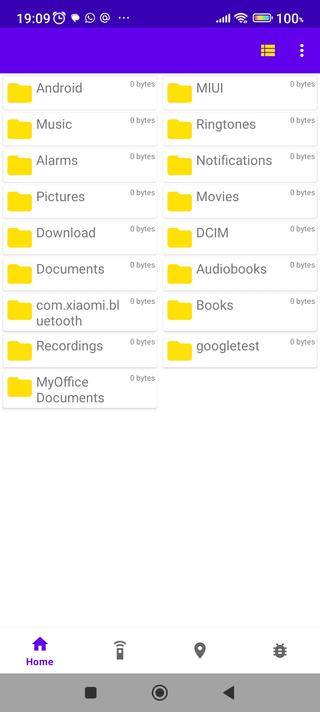
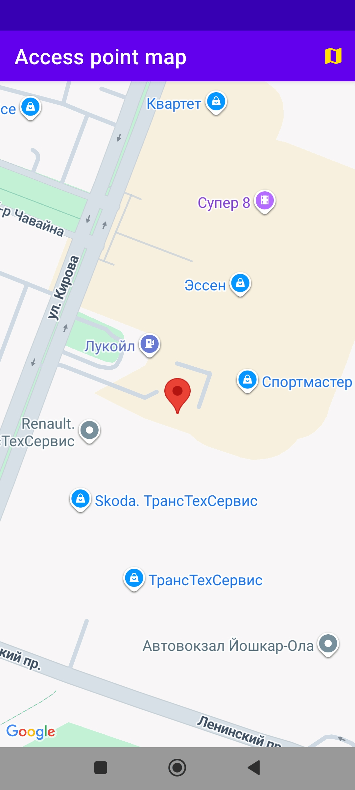

# lookatnet

> Phone file explorer with location-aware map view

**lookatnet** is an Android file manager that lets you browse local and network (SMB/CIFS) storage, preview files, and visualize places on a Google Map.

## ✨ Features

- **Local file browsing** — navigate the device filesystem with folder/file filtering
- **Media previews** — images (Glide + subsampling for large files), videos
- **Map view** — show saved places on Google Maps (`MapsActivity`)
- **Recent & bookmarks** — Room database persistence
- **WorkManager background jobs**, Navigation Component, View Binding

## 📱 Screenshots

| File browser | Map view |
|:---:|:---:|
|  |  |

<!-- Add your screenshots to docs/screenshots/ -->

## 🚀 Getting Started

### Prerequisites

- Android Studio (Hedgehog or later)
- JDK 17
- Android SDK 34
- Google Maps API key (for the map feature)

### Build & Run

```bash
git clone https://github.com/mansurv/lookatnet.git
cd lookatnet
./gradlew assembleDebug
# or open in Android Studio and hit Run
